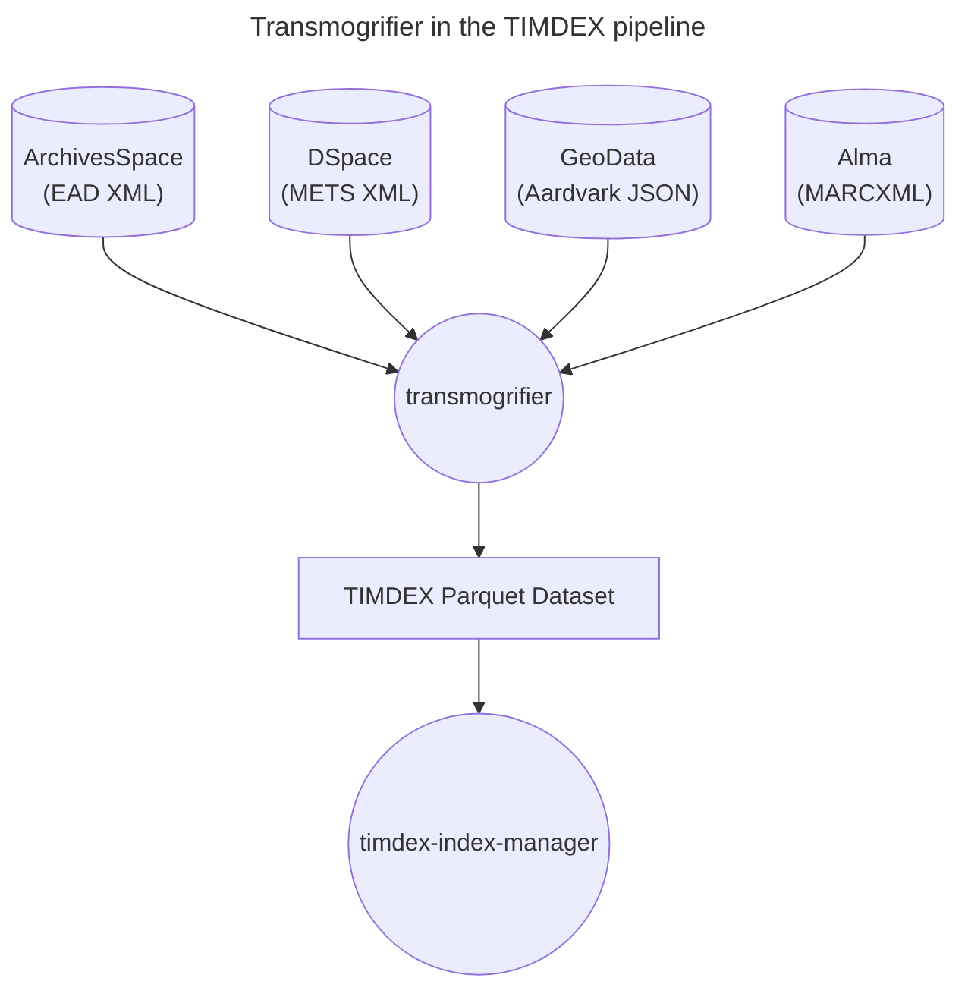

# transmogrifier

An application to transform source records to the TIMDEX data model to facilitate ingest into an OpenSearch index.

TIMDEX ingests records from various sources with different metadata formats, necessitating an application to transform those source records to a common metadata format, the TIMDEX data model in this case. This application processes source records, creates records formatted according to the TIMDEX data model, and writes to a TIMDEX parquet dataset. 



The TIMDEX data model is designed to produce records that can be successfully ingested into an OpenSearch index and contains data fields that are broadly applicable to various types of records. `transmogrifier` contains different validators to ensure that the record is structured properly and that certain types of values, such as dates, align with OpenSearch's expectations.

Each source is defined with configuration values and a dedicated transform class to process records from that source. For each transform class, various errors and warnings are logged. Some errors are logged and the entire source record is skipped because the severity implies it should not be processed until fixed, while others are merely logged as warnings for later review. The application also determines which records are marked as deleted in each source and removes those record from the OpenSearch index. 

After Transmogrifier writes the transformed files to the TIMDEX parquet dataset, it is processed by `timdex-index-manager` for ingest into an OpenSearch index.

## Development

- To preview a list of available Makefile commands: `make help`
- To install with dev dependencies: `make install`
- To update dependencies: `make update`
- To run unit tests: `make test`
- To lint the repo: `make lint`
- To run the app: `pipenv run transform <command>`

## Environment Variables

### Required 

```shell
SENTRY_DSN=### If set to a valid Sentry DSN, enables Sentry exception monitoring. This is not needed for local development.
STATUS_UPDATE_INTERVAL=### The transform process logs the # of records transformed every nth record (1000 by default). Set this env variable to any integer to change the frequency of logging status updates. Can be useful for developm ent/debugging.
WORKSPACE=### Set to `dev` for local development, this will be set to `stage` and `prod` in those environments by Terraform.
```

### Optional

```shell
ETL_VERSION=### Version number of the TIMDEX ETL infrastructure.  This can be used to align application behavior with the requirements of other applications in the TIMDEX ETL pipeline.
```

## CLI commands

### `transform`

```text
Usage: -c [OPTIONS]

Options:
  -i, --input-file TEXT           Filepath for harvested input records to
                                  transform  [required]
  --output-file TEXT              Filepath to write output TIMDEX JSON records
                                  to. NOTE: this option will be removed when
                                  output to parquet is finalized.
  -o, --output-location TEXT      Location of TIMDEX parquet dataset to write
                                  to.
  -s, --source [alma|aspace|dspace|jpal|libguides|gismit|gisogm|researchdatabases|whoas|zenodo]
                                  Source records were harvested from, must
                                  choose from list of options  [required]
  -r, --run-id TEXT               Identifier for Transmogrifier run.  This can
                                  be used to group transformed records
                                  produced by Transmogrifier, even if they
                                  span multiple CLI invocations.  If a value
                                  is not provided a UUID will be minted and
                                  used.
  -v, --verbose                   Pass to log at debug level instead of info
  --help                          Show this message and exit.
```