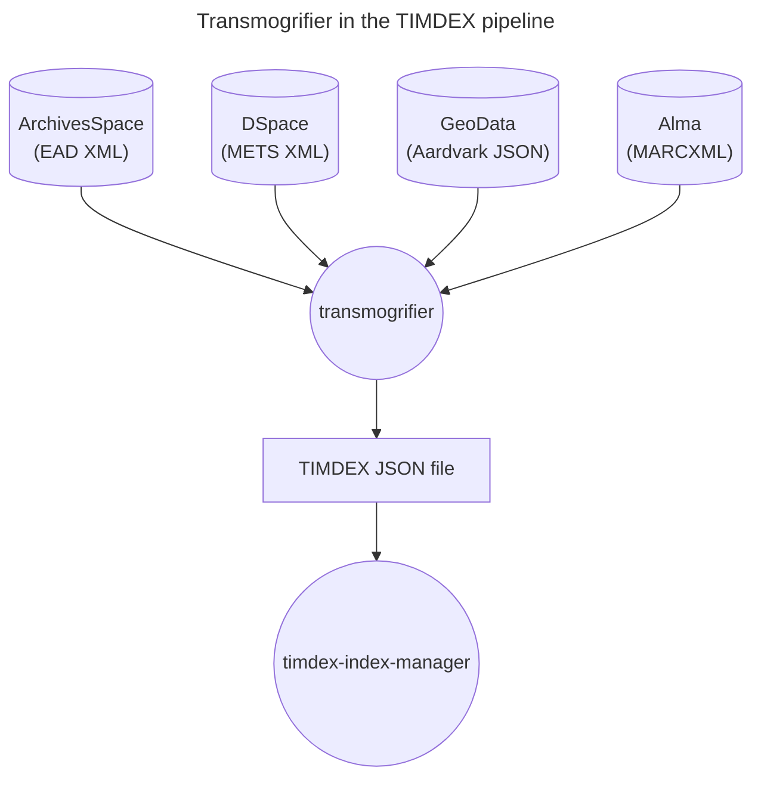

# transmogrifier

An application to transform source records to the TIMDEX data model to facilitate ingest into an OpenSearch index.

## Description

TIMDEX ingests records from various sources with different metadata formats, necessitating an application to transform those source records to a common metadata format, the TIMDEX data model in this case. This application processes both XML and JSON source records and outputs a JSON file of records formatted according to the TIMDEX data model. 



The TIMDEX data model is designed to produce records that can be successfully ingested into an OpenSearch index and contains data fields that are broadly applicable to various types of records. `transmogrifier` contains different validators to ensure that the record is structured properly and that certain types of values, such as dates, align with OpenSearch's expectations.

Each source is defined with configuration values and a dedicated transform class to process records from that source. For each transform class, various errors and warnings are logged. Some errors are logged and the entire source record is skipped because the severity implies it should not be processed until fixed, while others are merely logged as warnings for later review. The application also determines which records are marked as deleted in each source and removes those record from the OpenSearch index. 

After the JSON file of transformed records is produced, it is processed by `timdex-index-manager` for ingest into an OpenSearch index.

## Development

To install with dev dependencies:

```
make install
```

To run unit tests:

```
make test
```

To lint the repo:

```
make lint
```

To run the app:

```
pipenv run transform <command>
```

## Required ENV

`SENTRY_DSN` = If set to a valid Sentry DSN, enables Sentry exception monitoring. This is not needed for local development.

`STATUS_UPDATE_INTERVAL` = The transform process logs the # of records transformed every nth record (1000 by default). Set this env variable to any integer to change the frequency of logging status updates. Can be useful for development/debugging.

`WORKSPACE` = Set to `dev` for local development, this will be set to `stage` and `prod` in those environments by Terraform.
