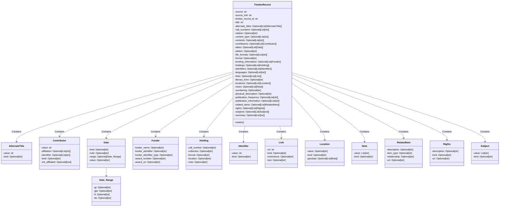

```mermaid
classDiagram
    class AlternateTitle {
        -value: str
        -kind: Optional[str]
    }

    class Contributor {
        -value: str
        -affiliation: Optional[List[str]]
        -identifier: Optional[List[str]]
        -kind: Optional[str]
        -mit_affiliated: Optional[bool]
    }

    class Date_Range {
        -gt: Optional[str]
        -gte: Optional[str]
        -lt: Optional[str]
        -lte: Optional[str]
    }

    class Date {
        -kind: Optional[str]
        -note: Optional[str]
        -range: Optional[Date_Range]
        -value: Optional[str]
    }

    class Funder {
        -funder_name: Optional[str]
        -funder_identifier: Optional[str]
        -funder_identifier_type: Optional[str]
        -award_number: Optional[str]
        -award_uri: Optional[str]
    }

    class Holding {
        -call_number: Optional[str]
        -collection: Optional[str]
        -format: Optional[str]
        -location: Optional[str]
        -note: Optional[str]
    }

    class Identifier {
        -value: str
        -kind: Optional[str]
    }

    class Link {
        -url: str
        -kind: Optional[str]
        -restrictions: Optional[str]
        -text: Optional[str]
    }

    class Location {
        -value: Optional[str]
        -kind: Optional[str]
        -geodata: Optional[List[float]]
    }

    class Note {
        -value: List[str]
        -kind: Optional[str]
    }

    class RelatedItem {
        -description: Optional[str]
        -item_type: Optional[str]
        -relationship: Optional[str]
        -uri: Optional[str]
    }

    class Rights {
        -description: Optional[str]
        -kind: Optional[str]
        -uri: Optional[str]
    }

    class Subject {
        -value: List[str]
        -kind: Optional[str]
    }

    class TimdexRecord {
        +asdict()
        -source: str
        -source_link: str
        -timdex_record_id: str
        -title: str
        -alternate_titles: Optional[List[AlternateTitle]]
        -call_numbers: Optional[List[str]]
        -citation: Optional[str]
        -content_type: Optional[List[str]]
        -contents: Optional[List[str]]
        -contributors: Optional[List[Contributor]]
        -dates: Optional[List[Date]]
        -edition: Optional[str]
        -file_formats: Optional[List[str]]
        -format: Optional[str]
        -funding_information: Optional[List[Funder]]
        -holdings: Optional[List[Holding]]
        -identifiers: Optional[List[Identifier]]
        -languages: Optional[List[str]]
        -links: Optional[List[Link]]
        -literary_form: Optional[str]
        -locations: Optional[List[Location]]
        -notes: Optional[List[Note]]
        -numbering: Optional[str]
        -physical_description: Optional[str]
        -publication_frequency: Optional[List[str]]
        -publication_information: Optional[List[str]]
        -related_items: Optional[List[RelatedItem]]
        -rights: Optional[List[Rights]]
        -subjects: Optional[List[Subject]]
        -summary: Optional[List[str]]
    }

    Date --> Date_Range
    TimdexRecord --> AlternateTitle: Contains
    TimdexRecord --> Contributor: Contains
    TimdexRecord --> Date: Contains
    TimdexRecord --> Funder: Contains
    TimdexRecord --> Holding: Contains
    TimdexRecord --> Identifier: Contains
    TimdexRecord --> Link: Contains
    TimdexRecord --> Location: Contains
    TimdexRecord --> Note: Contains
    TimdexRecord --> RelatedItem: Contains
    TimdexRecord --> Rights: Contains
    TimdexRecord --> Subject: Contains

    
    
    
```